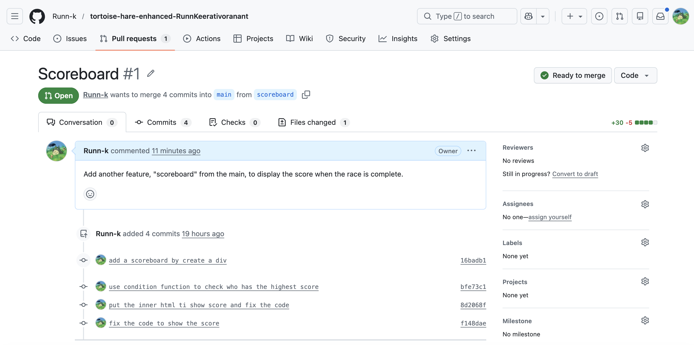

# Hello

## What feature did you implement?

I selected a Scoreboard feature to display the score when the tortoise and the hare complete the race every round.

## What was the most difficult bug or issue?

My issue is about the coding part that the function it doesn't work because when i call the function it was the wrong position and order within the JS code.

## 3 best commit messages.

1 use condition function to check who has the highest score
2 put the inner html ti show score and fix the code
3 fix the code to show the score

## a screenshot of your Pull Request page.

